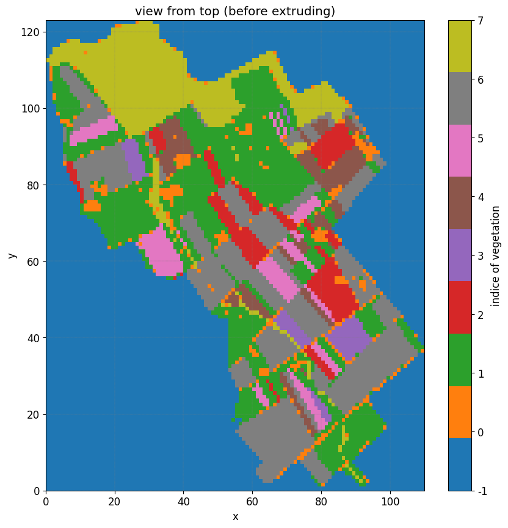
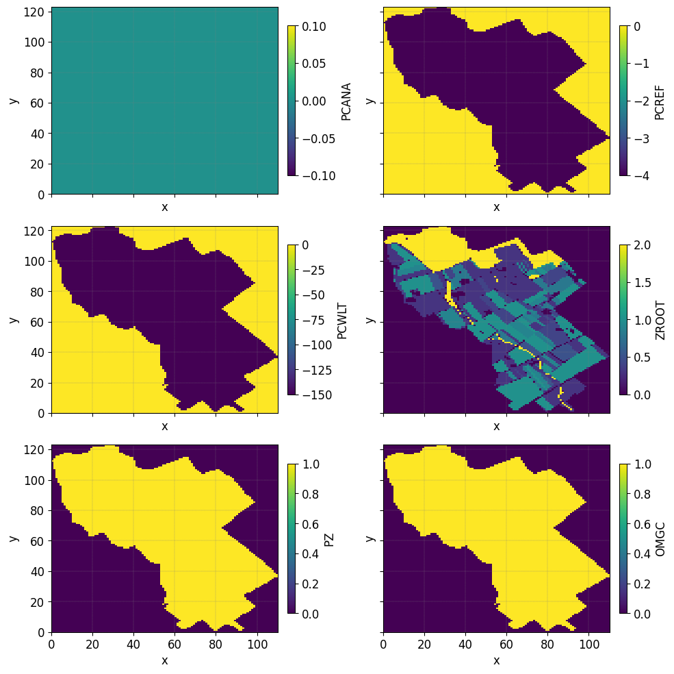
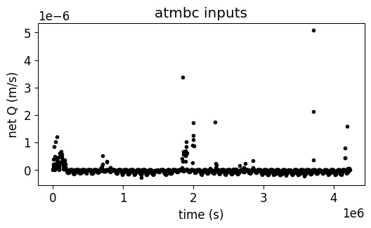
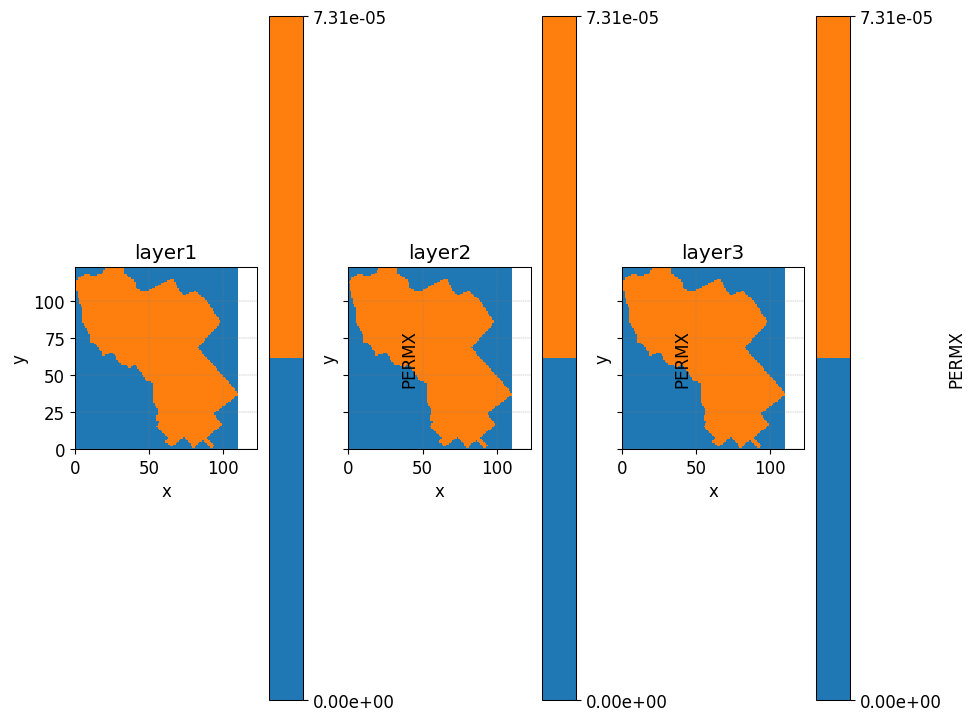
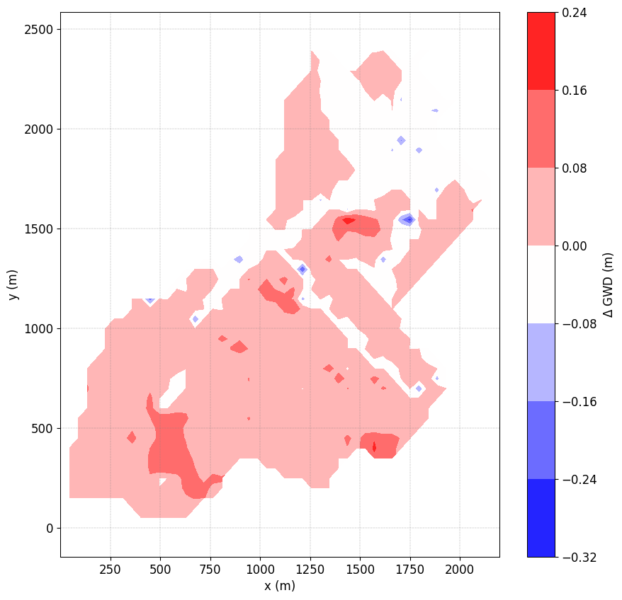

D. La Cecilia and M. Camporese (2022)
=======================================

This is a notebook to reproduce outputs from `La Cecilia and Camporese
(2022) <https://onlinelibrary.wiley.com/doi/10.1002/hyp.14768>`__

.. code:: {important}

   # Cite this work
   We believe in a community-driven approach of open-source tools that are
   composable and extensible. If you use this notebook cite the work as:
   > La Cecilia, D., and M. Camporese. 2022. Resolving streamflow diel fluctuations in a small agricultural catchment with an integrated surface‐subsurface hydrological model. Hydrological Processes 36(12). doi: 10.1002/hyp.14768.

The notebooks describes:

1. **Preprocessing step**: how to build a mesh with different vegetation
   land cover and a soil including tile drains.

   -  Changing atmospheric boundary conditions **Atmbc parameters**
   -  Changing **Feddes parameters**
   -  Changing **Soil parameters**

2. **Simulation** (very long not recommanded to execute): solve the
   surface-subsurface flow during a year considering different
   scenarios.

3. **Plot outputs**: analysis of the results

   -  spatial distribution of **actual ET**
   -  spatial distribution of **groundwater level depth**

\```{note} In Progress

All input and ouput data from this study will be openly and publicly
available through the Eawag repository ERIC at
https://opendata.eawag.ch/group under the project folder
**“NAWA-Flowpath”** to ensure that these data are **FAIR: Findable,
Accessible, Interoperable and Reproducible**.

The CATHY model is freely available at
`https://bitbucket.org/cathy1_0/cathy/ <https://bitbucket.org/cathy1_0/cathy>`__.

.. code:: python

   import pooch
   https://opendata.eawag.ch/group

:literal:`{admonition} What you should already know In order to complete this tutorial, you should be relatively familiar with using the pyCATHY for: - Building a mesh from a DEM (See {doc}`../content/SSHydro/index` for more information.) - Updating soil inputs - ...`

.. code:: {warning}

   Found a bug 🐛/ a typo ? [Email me](mailto:benjamin.mary@unipd.it)

Importing the required packages
~~~~~~~~~~~~~~~~~~~~~~~~~~~~~~~

-  ``matplotlib`` in order to **plot** the data;
-  ``cathy_tools`` is the main object controlling the simulation;
-  ``pyCATHY.importers`` allows you to **read CATHY input** files;
-  ``pyCATHY.importers`` allows you to **read CATHY output** files;
-  ``pyCATHY.plotters`` is a set of functions in order to plot
   simulation outputs.

.. code:: ipython3

    import os
    import matplotlib.pyplot as plt
    import numpy as np
    from pyCATHY import cathy_tools
    from pyCATHY.importers import cathy_inputs as in_CT
    from pyCATHY.importers import cathy_outputs as out_CT
    from pyCATHY.plotters import cathy_plots as cplt
    
    import matplotlib as mpl
    # set some default plotting parameters for nicer looking plots
    mpl.rcParams.update({"axes.grid":True, "grid.color":"gray", "grid.linestyle":'--','figure.figsize':(10,10)})

Create a CATHY simulation object
~~~~~~~~~~~~~~~~~~~~~~~~~~~~~~~~

.. code:: ipython3

    # Initiate a CATHY model
    # ------------------------
    path2prj = '.'  # add your local path here
    simu = cathy_tools.CATHY(dirName=path2prj, prj_name="LaCecilia_2022_HP")


.. raw:: html

    <pre style="white-space:pre;overflow-x:auto;line-height:normal;font-family:Menlo,'DejaVu Sans Mono',consolas,'Courier New',monospace">🏁 <span style="font-weight: bold">Initiate CATHY object</span>
    </pre>


\```{tip} Multiples scenario

If you want to run multiple scenario and compare them it is recommanded
to create a single CATHY object for each of the simulations. For
instance:

.. code:: python

   simu_scenario1 = cathy_tools.CATHY(dirName=ThePathToYourProject, prj_name="scenario1")
   simu_scenario2 = cathy_tools.CATHY(dirName=ThePathToYourProject, prj_name="scenario2")

1. Preprocessing step
---------------------

Starting from DEM data (dtm_13.val) and parameters (hap.in) files, the
preprocessing produce a complete set of files describing physiographic
features of a drainage system. Such files represent the preprocessing
input files for CATHY simulation.

Build the mesh
~~~~~~~~~~~~~~

The **DEM** should be accurate enough to account for an explicit
representation of tile trains (diameter between 10 and 60 cm) - spatial
resolution of 20x20 m necessary

.. code:: {tip}

   Outside the region of interest the elevation are set to -9999

.. code:: ipython3

    DEM, header_DEM = simu.read_inputs('dem')

.. code:: ipython3

    fig, ax = plt.subplots(1)
    img = ax.imshow(DEM,vmin=0,vmax=500)
    plt.colorbar(img)
    simu.show_input(prop="dem",vmin=0,vmax=500)


.. raw:: html

    <pre style="white-space:pre;overflow-x:auto;line-height:normal;font-family:Menlo,'DejaVu Sans Mono',consolas,'Courier New',monospace">🔄 <span style="font-weight: bold">Update hap.in file</span>
    </pre>


.. raw:: html

    <pre style="white-space:pre;overflow-x:auto;line-height:normal;font-family:Menlo,'DejaVu Sans Mono',consolas,'Courier New',monospace">🔄 <span style="font-weight: bold">update dem_parameters file </span>
    </pre>


.. image:: output_14_2.png


Define root map properties
~~~~~~~~~~~~~~~~~~~~~~~~~~

The **``veg_map``** is a raster file that defined the position of the
vegetation.

.. code:: ipython3

    VEG_MAP, header_veg_map = simu.read_inputs('root_map')
    VEG_MAP


.. parsed-literal::

    array([[0., 0., 0., ..., 0., 0., 0.],
           [0., 0., 0., ..., 0., 0., 0.],
           [0., 0., 0., ..., 0., 0., 0.],
           ...,
           [0., 0., 0., ..., 0., 0., 0.],
           [0., 0., 0., ..., 0., 0., 0.],
           [0., 0., 0., ..., 0., 0., 0.]])


.. code:: ipython3

    fig, ax = plt.subplots(1)
    simu.show_input(prop="root_map", ax=ax,
                   linewidth=0)





The figure illustrates the vegetation indices, with each index
associated with a corresponding pair of Feddes parameters. In the
northern region, represented by the forested areas, a root depth of 2
meters is considered. However, in the orange patches indicating urban
areas, the root depth is set to a significantly smaller value of 1e-3.

Now we check the values of the Feddes parameters associated with the
indice of the vegetation

:literal:`{note} Feddes parameters - `PCANA`: anaerobiosis point - `PCREF`: field capacity - `PCWLT`: wilting point - `ZROOT`: root depth - `PZ`: pz is an empirical parameter - `OMGC`: 0<OMGC<1 Compensatory mechanisms for root water uptake`

.. code:: ipython3

    SPP, FP = simu.read_inputs('soil', MAXVEG=8)
    FP


.. raw:: html

    <div>
    <style scoped>
        .dataframe tbody tr th:only-of-type {
            vertical-align: middle;
        }
    
        .dataframe tbody tr th {
            vertical-align: top;
        }
    
        .dataframe thead th {
            text-align: right;
        }
    </style>
    <table border="1" class="dataframe">
      <thead>
        <tr style="text-align: right;">
          <th></th>
          <th>PCANA</th>
          <th>PCREF</th>
          <th>PCWLT</th>
          <th>ZROOT</th>
          <th>PZ</th>
          <th>OMGC</th>
        </tr>
        <tr>
          <th>Veg. Indice</th>
          <th></th>
          <th></th>
          <th></th>
          <th></th>
          <th></th>
          <th></th>
        </tr>
      </thead>
      <tbody>
        <tr>
          <th>0</th>
          <td>0.0</td>
          <td>-4.0</td>
          <td>-150.0</td>
          <td>0.001</td>
          <td>1.0</td>
          <td>1.0</td>
        </tr>
        <tr>
          <th>1</th>
          <td>0.0</td>
          <td>-4.0</td>
          <td>-150.0</td>
          <td>0.300</td>
          <td>1.0</td>
          <td>1.0</td>
        </tr>
        <tr>
          <th>2</th>
          <td>0.0</td>
          <td>-4.0</td>
          <td>-150.0</td>
          <td>0.400</td>
          <td>1.0</td>
          <td>1.0</td>
        </tr>
        <tr>
          <th>3</th>
          <td>0.0</td>
          <td>-4.0</td>
          <td>-150.0</td>
          <td>0.500</td>
          <td>1.0</td>
          <td>1.0</td>
        </tr>
        <tr>
          <th>4</th>
          <td>0.0</td>
          <td>-4.0</td>
          <td>-150.0</td>
          <td>0.800</td>
          <td>1.0</td>
          <td>1.0</td>
        </tr>
        <tr>
          <th>5</th>
          <td>0.0</td>
          <td>-4.0</td>
          <td>-150.0</td>
          <td>0.900</td>
          <td>1.0</td>
          <td>1.0</td>
        </tr>
        <tr>
          <th>6</th>
          <td>0.0</td>
          <td>-4.0</td>
          <td>-150.0</td>
          <td>1.000</td>
          <td>1.0</td>
          <td>1.0</td>
        </tr>
        <tr>
          <th>7</th>
          <td>0.0</td>
          <td>-4.0</td>
          <td>-150.0</td>
          <td>2.000</td>
          <td>1.0</td>
          <td>1.0</td>
        </tr>
      </tbody>
    </table>
    </div>


We can also plot the spatial distribution of the Feddes parameters

.. code:: ipython3

    simu.update_veg_map()
    simu.update_soil(FP_map=FP, show=True)


.. raw:: html

    <pre style="white-space:pre;overflow-x:auto;line-height:normal;font-family:Menlo,'DejaVu Sans Mono',consolas,'Courier New',monospace"><span style="color: #808000; text-decoration-color: #808000">─────────────────────────────────────────── </span>⚠ warning messages above ⚠<span style="color: #808000; text-decoration-color: #808000"> ────────────────────────────────────────────</span>
    </pre>


.. raw:: html

    <pre style="white-space:pre;overflow-x:auto;line-height:normal;font-family:Menlo,'DejaVu Sans Mono',consolas,'Courier New',monospace">
    <span style="color: #808000; text-decoration-color: #808000">                            The parm dictionnary is empty</span>
    <span style="color: #808000; text-decoration-color: #808000">                            Falling back to defaults to update CATHYH</span>
    <span style="color: #808000; text-decoration-color: #808000">                            This can have consequences !!</span>
    <span style="color: #808000; text-decoration-color: #808000">                            </span>
    </pre>


.. raw:: html

    <pre style="white-space:pre;overflow-x:auto;line-height:normal;font-family:Menlo,'DejaVu Sans Mono',consolas,'Courier New',monospace"><span style="color: #808000; text-decoration-color: #808000">───────────────────────────────────────────────────────────────────────────────────────────────────────────────────</span>
    </pre>


.. raw:: html

    <pre style="white-space:pre;overflow-x:auto;line-height:normal;font-family:Menlo,'DejaVu Sans Mono',consolas,'Courier New',monospace">🔄 <span style="font-weight: bold">update parm file </span>
    </pre>


.. raw:: html

    <pre style="white-space:pre;overflow-x:auto;line-height:normal;font-family:Menlo,'DejaVu Sans Mono',consolas,'Courier New',monospace">🔄 <span style="font-weight: bold">Update soil</span>
    </pre>


.. raw:: html

    <pre style="white-space:pre;overflow-x:auto;line-height:normal;font-family:Menlo,'DejaVu Sans Mono',consolas,'Courier New',monospace">homogeneous soil
    </pre>





Setting the atmospheric boundary conditions
~~~~~~~~~~~~~~~~~~~~~~~~~~~~~~~~~~~~~~~~~~~

**Scenario 1**, excludes irrigation from the reference simulation. This
scenario serves primarily to assess the differences between an
agricultural catchment and a natural one.

In order to update the atmospheric boundary conditions we call the
following function:

.. code:: python

   simu.update_atmbc()

Remenber that the functions arguments details can be assessed via:

.. code:: python

   help(simu.update_atmbc())

.. code:: ipython3

    # first we read and plot the current atmbc file 
    # --------------------------------
    df_atmbc = simu.read_inputs('atmbc')
    simu.show_input('atmbc')





Given the fact that all the values are defined in net Q (m/s), and that
all the values are >0, here the scenario exclude the irrigation from the
atmospheric boundary conditions.

Let’s update the atmbc values without to with irrigation:

.. code:: ipython3

    # first we read the atmbc file 
    # --------------------------------
    atmbc_hourlyf = os.path.join(simu.workdir,simu.project_name,'input','atmbc_hourly')
    df_atmbc_hourly, HSPATM, IETO = in_CT.read_atmbc(atmbc_hourlyf)

.. code:: ipython3

    help(simu.update_atmbc)
    df_atmbc_hourly = df_atmbc_hourly.iloc[0:-2]


.. parsed-literal::

    Help on method update_atmbc in module pyCATHY.cathy_tools:
    
    update_atmbc(HSPATM=0, IETO=0, time=None, VALUE=[None, None], netValue=[], show=False, verbose=False, **kwargs) method of pyCATHY.cathy_tools.CATHY instance
        Atmospheric forcing term (atmbc - IIN6)
        
        ..note:
        
        
                1 1                HSPATM,IETO
                0.0000000e+00      time
                5.5e-06              VALUE
                12.000000e+03      time
                0.00                 VALUE
                18.000000e+03      time
                0.00                 VALUE
        
                The values are those of a 200-min rainfall event at a uniform
                intensity of 3.3·10-4 m/min, followed by 100 min of drainage.
        
        ..note:
        
                In case of simultaneous precipitation and evaporation, we impose at
                the surface the net flux, i.e., precipitation minus evaporation.
        
        
        
        
        
        Parameters
        ----------
        HSPATM : int, optional
            - =0 for spatially variable atmospheric boundary condition inputs;
            blank or =9999 if unit IIN6 input is to be ignored; otherwise atmospheric BC's are
            homogeneous in space.
        IETO : int, optional
            - =0 for linear interpolation of the atmospheric boundary condition inputs between different
            - otherwise the inputs are assigned as a piecewise constant function (ietograph).
            The default is 0.
        time : list
            ATMBC Times in seconds. The default is None.
        VALUE : list
            List of array. The default is [Precipitation, EvapoTranspiration].
        show : bool, optional
            Plot atmbc. The default is False.
        verbose : bool, optional
            Display. The default is False.
        **kwargs
        
        Returns
        -------
        
        ..note:
        
                - Update parm file (NPRT).
                - Update CATHYH file (MAXPRT).
    


.. code:: ipython3

    simu.update_atmbc(
                        HSPATM=1,
                        IETO=0,
                        time=list(df_atmbc_hourly['time']),
                        netValue=list(df_atmbc_hourly['value']),
    )
    simu.show_input('atmbc')


.. raw:: html

    <pre style="white-space:pre;overflow-x:auto;line-height:normal;font-family:Menlo,'DejaVu Sans Mono',consolas,'Courier New',monospace">🔄 <span style="font-weight: bold">Update atmbc</span>
    </pre>


.. raw:: html

    <pre style="white-space:pre;overflow-x:auto;line-height:normal;font-family:Menlo,'DejaVu Sans Mono',consolas,'Courier New',monospace">🔄 <span style="font-weight: bold">update parm file </span>
    </pre>


.. image:: output_29_2.png


Scenario with varying Feddes parameters
~~~~~~~~~~~~~~~~~~~~~~~~~~~~~~~~~~~~~~~

In **Scenario 2**, we additionally **excluded the effect of oxygen
stress**, whereby roots could take up water even when soil moisture
exceeded a threshold according to the Feddes approach

.. code:: python

   simu.update_soil(FP=new_feddes_parameters)

We considered two test cases in **Scenario 3**. Starting from Scenario
2, we assumed a **homogeneous rooting depth** of 0.3 m in the first case
and of 2.0 m in the second one.

.. code:: python

   simu.update_soil(FP=new_feddes_parameters)

.. code:: ipython3

    # first we read the current soil file 
    # --------------------------------
    simu.update_veg_map()
    df_soil_het, df_FP = simu.read_inputs('soil')
    
    # show Feddes parameters table
    # --------------------------------
    df_FP


.. raw:: html

    <div>
    <style scoped>
        .dataframe tbody tr th:only-of-type {
            vertical-align: middle;
        }
    
        .dataframe tbody tr th {
            vertical-align: top;
        }
    
        .dataframe thead th {
            text-align: right;
        }
    </style>
    <table border="1" class="dataframe">
      <thead>
        <tr style="text-align: right;">
          <th></th>
          <th>PCANA</th>
          <th>PCREF</th>
          <th>PCWLT</th>
          <th>ZROOT</th>
          <th>PZ</th>
          <th>OMGC</th>
        </tr>
        <tr>
          <th>Veg. Indice</th>
          <th></th>
          <th></th>
          <th></th>
          <th></th>
          <th></th>
          <th></th>
        </tr>
      </thead>
      <tbody>
        <tr>
          <th>0</th>
          <td>0.0</td>
          <td>-4.0</td>
          <td>-150.0</td>
          <td>0.001</td>
          <td>1.0</td>
          <td>1.0</td>
        </tr>
        <tr>
          <th>1</th>
          <td>0.0</td>
          <td>-4.0</td>
          <td>-150.0</td>
          <td>0.300</td>
          <td>1.0</td>
          <td>1.0</td>
        </tr>
        <tr>
          <th>2</th>
          <td>0.0</td>
          <td>-4.0</td>
          <td>-150.0</td>
          <td>0.400</td>
          <td>1.0</td>
          <td>1.0</td>
        </tr>
        <tr>
          <th>3</th>
          <td>0.0</td>
          <td>-4.0</td>
          <td>-150.0</td>
          <td>0.500</td>
          <td>1.0</td>
          <td>1.0</td>
        </tr>
        <tr>
          <th>4</th>
          <td>0.0</td>
          <td>-4.0</td>
          <td>-150.0</td>
          <td>0.800</td>
          <td>1.0</td>
          <td>1.0</td>
        </tr>
        <tr>
          <th>5</th>
          <td>0.0</td>
          <td>-4.0</td>
          <td>-150.0</td>
          <td>0.900</td>
          <td>1.0</td>
          <td>1.0</td>
        </tr>
        <tr>
          <th>6</th>
          <td>0.0</td>
          <td>-4.0</td>
          <td>-150.0</td>
          <td>1.000</td>
          <td>1.0</td>
          <td>1.0</td>
        </tr>
        <tr>
          <th>7</th>
          <td>0.0</td>
          <td>-4.0</td>
          <td>-150.0</td>
          <td>2.000</td>
          <td>1.0</td>
          <td>1.0</td>
        </tr>
      </tbody>
    </table>
    </div>


From the table above we observe the values of the Feddes parameters for
the different zones defined in the figure above. Here Zroot is varying
according to the root map zone.

Check soil properties
~~~~~~~~~~~~~~~~~~~~~

The project folder includes: - A file with **homogeneous** properties -
A file with **heterogeneous** properties for which the hydraulic
conductivity of the layer number 6 is set to :math:`0.001 m-s^{-1}`
(>0.000073 for other layers)

The soil is discretise in 3 distinct layers:

+---------+---------+---------+---------+---------+---------+---------+
| Depth   | P       | R       | Van     | Van     | S       | Sa      |
| (cm)    | orosity | esidual | Ge      | Ge      | pecific | turated |
|         |         | m       | nuchten | nuchten | storage | hy      |
|         |         | oisture | /       | n       | coef    | draulic |
|         |         | content | (cm^-1) |         | ficient | condu   |
|         |         |         |         |         | (m^-1)  | ctivity |
|         |         |         |         |         |         | (m/s)   |
+=========+=========+=========+=========+=========+=========+=========+
| 0-80    | 0.43    | 0.078   | 0.036   | 1.56    | 1.00 x  | 7.3 x   |
|         |         |         |         |         | 10^-3   | 10^-5   |
+---------+---------+---------+---------+---------+---------+---------+
| 80-140  | 0.43    | 0.078   | 0.036   | 1.56    | 1.00 x  | 1.0 x   |
| (Tile   |         |         |         |         | 10^-3   | 10^-3   |
| -drain) |         |         |         |         |         |         |
+---------+---------+---------+---------+---------+---------+---------+
| 140–500 | 0.43    | 0.078   | 0.036   | 1.56    | 1.00 x  | 7.3 x   |
|         |         |         |         |         | 10^-3   | 10^-5   |
+---------+---------+---------+---------+---------+---------+---------+

\`\`\ ``{note} Van Genuchten parameters in CATHY -``\ PERMX\ ``(NSTR, NZONE): saturated hydraulic conductivity - xx -``\ PERMY\ ``(NSTR, NZONE): saturated hydraulic conductivity - yy -``\ PERMZ\ ``(NSTR, NZONE): saturated hydraulic conductivity - zz -``\ ELSTOR\ ``(NSTR, NZONE): specific storage -``\ POROS\`
(NSTR, NZONE): porosity (moisture content at saturation) =
:raw-latex:`\thetaS`

Retention curves parameters VGN, VGRMC, and VGPSAT - ``VGNCELL`` (NSTR,
NZONE): van Genuchten curve exponent = n - ``VGRMCCELL`` (NSTR, NZONE):
residual moisture content = :raw-latex:`\thetaR` - ``VGPSATCELL`` (NSTR,
NZONE): van Genuchten curve exponent –> - ``VGPSAT`` == -1/alpha (with
alpha expressed in [L-1]); \``\`

.. code:: ipython3

    df_soil, df_FP = simu.read_inputs('soil')
    df_soil


.. raw:: html

    <div>
    <style scoped>
        .dataframe tbody tr th:only-of-type {
            vertical-align: middle;
        }
    
        .dataframe tbody tr th {
            vertical-align: top;
        }
    
        .dataframe thead th {
            text-align: right;
        }
    </style>
    <table border="1" class="dataframe">
      <thead>
        <tr style="text-align: right;">
          <th></th>
          <th></th>
          <th>PERMX</th>
          <th>PERMY</th>
          <th>PERMZ</th>
          <th>ELSTOR</th>
          <th>POROS</th>
          <th>VGNCELL</th>
          <th>VGRMCCELL</th>
          <th>VGPSATCELL</th>
        </tr>
        <tr>
          <th>str</th>
          <th>zone</th>
          <th></th>
          <th></th>
          <th></th>
          <th></th>
          <th></th>
          <th></th>
          <th></th>
          <th></th>
        </tr>
      </thead>
      <tbody>
        <tr>
          <th>0</th>
          <th>0</th>
          <td>0.000188</td>
          <td>0.000188</td>
          <td>0.000188</td>
          <td>0.00001</td>
          <td>0.55</td>
          <td>1.46</td>
          <td>0.15</td>
          <td>0.03125</td>
        </tr>
        <tr>
          <th>1</th>
          <th>0</th>
          <td>0.000188</td>
          <td>0.000188</td>
          <td>0.000188</td>
          <td>0.00001</td>
          <td>0.55</td>
          <td>1.46</td>
          <td>0.15</td>
          <td>0.03125</td>
        </tr>
        <tr>
          <th>2</th>
          <th>0</th>
          <td>0.000188</td>
          <td>0.000188</td>
          <td>0.000188</td>
          <td>0.00001</td>
          <td>0.55</td>
          <td>1.46</td>
          <td>0.15</td>
          <td>0.03125</td>
        </tr>
        <tr>
          <th>3</th>
          <th>0</th>
          <td>0.000188</td>
          <td>0.000188</td>
          <td>0.000188</td>
          <td>0.00001</td>
          <td>0.55</td>
          <td>1.46</td>
          <td>0.15</td>
          <td>0.03125</td>
        </tr>
        <tr>
          <th>4</th>
          <th>0</th>
          <td>0.000188</td>
          <td>0.000188</td>
          <td>0.000188</td>
          <td>0.00001</td>
          <td>0.55</td>
          <td>1.46</td>
          <td>0.15</td>
          <td>0.03125</td>
        </tr>
        <tr>
          <th>5</th>
          <th>0</th>
          <td>0.000188</td>
          <td>0.000188</td>
          <td>0.000188</td>
          <td>0.00001</td>
          <td>0.55</td>
          <td>1.46</td>
          <td>0.15</td>
          <td>0.03125</td>
        </tr>
        <tr>
          <th>6</th>
          <th>0</th>
          <td>0.000188</td>
          <td>0.000188</td>
          <td>0.000188</td>
          <td>0.00001</td>
          <td>0.55</td>
          <td>1.46</td>
          <td>0.15</td>
          <td>0.03125</td>
        </tr>
        <tr>
          <th>7</th>
          <th>0</th>
          <td>0.000188</td>
          <td>0.000188</td>
          <td>0.000188</td>
          <td>0.00001</td>
          <td>0.55</td>
          <td>1.46</td>
          <td>0.15</td>
          <td>0.03125</td>
        </tr>
        <tr>
          <th>8</th>
          <th>0</th>
          <td>0.000188</td>
          <td>0.000188</td>
          <td>0.000188</td>
          <td>0.00001</td>
          <td>0.55</td>
          <td>1.46</td>
          <td>0.15</td>
          <td>0.03125</td>
        </tr>
        <tr>
          <th>9</th>
          <th>0</th>
          <td>0.000188</td>
          <td>0.000188</td>
          <td>0.000188</td>
          <td>0.00001</td>
          <td>0.55</td>
          <td>1.46</td>
          <td>0.15</td>
          <td>0.03125</td>
        </tr>
      </tbody>
    </table>
    </div>


.. code:: ipython3

    layers2plot= [1,6,9]
    
    fig, axs = plt.subplots(1,3, 
                            sharex=True, 
                            sharey=True
                           )
    axs= axs.ravel()
    for i, ax in enumerate(axs):
        simu.show_input(
                        prop="soil", 
                        yprop="PERMX", 
                        layer_nb=layers2plot[i],
                        ax = ax,
                        linewidth=0,
                       )
        ax.axis('square')
        ax.set_title('layer'+ str(i+1))


Read soil file with Tile-drain (and update existing soil file)

:literal:`{warning} pyCATHY naming convention The project folder comes with the default naming convention for the filenames. If you decide to rename the `soil` file, then you have to update the pyCATHY wrapper with the new values (this will overwrite the soil file).`

.. code:: ipython3

    # define the path to the soil file
    soilfile_het = os.path.join(simu.workdir,simu.project_name,'input','soil_het')
    
    # define the path to the dem_parameter file
    dem_parmfile = os.path.join(simu.workdir,simu.project_name,'input','dem_parameters')
    
    # define the path to the dem_parameter file
    dempar = in_CT.read_dem_parameters(dem_parmfile)
    
    # read soil heterogeneous file
    df_soil_het, _ = in_CT.read_soil(soilfile_het,dempar,MAXVEG=8)
    df_soil_het


.. raw:: html

    <div>
    <style scoped>
        .dataframe tbody tr th:only-of-type {
            vertical-align: middle;
        }
    
        .dataframe tbody tr th {
            vertical-align: top;
        }
    
        .dataframe thead th {
            text-align: right;
        }
    </style>
    <table border="1" class="dataframe">
      <thead>
        <tr style="text-align: right;">
          <th></th>
          <th></th>
          <th>PERMX</th>
          <th>PERMY</th>
          <th>PERMZ</th>
          <th>ELSTOR</th>
          <th>POROS</th>
          <th>VGNCELL</th>
          <th>VGRMCCELL</th>
          <th>VGPSATCELL</th>
        </tr>
        <tr>
          <th>str</th>
          <th>zone</th>
          <th></th>
          <th></th>
          <th></th>
          <th></th>
          <th></th>
          <th></th>
          <th></th>
          <th></th>
        </tr>
      </thead>
      <tbody>
        <tr>
          <th>0</th>
          <th>0</th>
          <td>0.000073</td>
          <td>0.000073</td>
          <td>0.000073</td>
          <td>0.001</td>
          <td>0.43</td>
          <td>1.56</td>
          <td>0.078</td>
          <td>0.27778</td>
        </tr>
        <tr>
          <th>1</th>
          <th>0</th>
          <td>0.000073</td>
          <td>0.000073</td>
          <td>0.000073</td>
          <td>0.001</td>
          <td>0.43</td>
          <td>1.56</td>
          <td>0.078</td>
          <td>0.27778</td>
        </tr>
        <tr>
          <th>2</th>
          <th>0</th>
          <td>0.000073</td>
          <td>0.000073</td>
          <td>0.000073</td>
          <td>0.001</td>
          <td>0.43</td>
          <td>1.56</td>
          <td>0.078</td>
          <td>0.27778</td>
        </tr>
        <tr>
          <th>3</th>
          <th>0</th>
          <td>0.000073</td>
          <td>0.000073</td>
          <td>0.000073</td>
          <td>0.001</td>
          <td>0.43</td>
          <td>1.56</td>
          <td>0.078</td>
          <td>0.27778</td>
        </tr>
        <tr>
          <th>4</th>
          <th>0</th>
          <td>0.000073</td>
          <td>0.000073</td>
          <td>0.000073</td>
          <td>0.001</td>
          <td>0.43</td>
          <td>1.56</td>
          <td>0.078</td>
          <td>0.27778</td>
        </tr>
        <tr>
          <th>5</th>
          <th>0</th>
          <td>0.001000</td>
          <td>0.001000</td>
          <td>0.001000</td>
          <td>0.001</td>
          <td>0.43</td>
          <td>1.56</td>
          <td>0.078</td>
          <td>0.27778</td>
        </tr>
        <tr>
          <th>6</th>
          <th>0</th>
          <td>0.000073</td>
          <td>0.000073</td>
          <td>0.000073</td>
          <td>0.001</td>
          <td>0.43</td>
          <td>1.56</td>
          <td>0.078</td>
          <td>0.27778</td>
        </tr>
        <tr>
          <th>7</th>
          <th>0</th>
          <td>0.000073</td>
          <td>0.000073</td>
          <td>0.000073</td>
          <td>0.001</td>
          <td>0.43</td>
          <td>1.56</td>
          <td>0.078</td>
          <td>0.27778</td>
        </tr>
        <tr>
          <th>8</th>
          <th>0</th>
          <td>0.000073</td>
          <td>0.000073</td>
          <td>0.000073</td>
          <td>0.001</td>
          <td>0.43</td>
          <td>1.56</td>
          <td>0.078</td>
          <td>0.27778</td>
        </tr>
        <tr>
          <th>9</th>
          <th>0</th>
          <td>0.000073</td>
          <td>0.000073</td>
          <td>0.000073</td>
          <td>0.001</td>
          <td>0.43</td>
          <td>1.56</td>
          <td>0.078</td>
          <td>0.27778</td>
        </tr>
      </tbody>
    </table>
    </div>


.. code:: ipython3

    simu.update_soil(SPP=df_soil_het)


.. raw:: html

    <pre style="white-space:pre;overflow-x:auto;line-height:normal;font-family:Menlo,'DejaVu Sans Mono',consolas,'Courier New',monospace">🔄 <span style="font-weight: bold">Update soil</span>
    </pre>


.. raw:: html

    <pre style="white-space:pre;overflow-x:auto;line-height:normal;font-family:Menlo,'DejaVu Sans Mono',consolas,'Courier New',monospace">homogeneous soil
    </pre>


.. code:: ipython3

    layers2plot= [1,6,9]
    
    fig, axs = plt.subplots(1,3, 
                            sharex=True, 
                            sharey=True
                           )
    axs= axs.ravel()
    for i, ax in enumerate(axs):
        simu.show_input(
                        prop="soil", 
                        yprop="PERMX", 
                        layer_nb=layers2plot[i],
                        ax = ax,
                        linewidth=0,
                       )
        ax.axis('square')
        ax.set_title('layer'+ str(i+1))





2. Run simulation
-----------------

Once all the inputs files are updated according to the scenario, it is
good practice to run first the preprocessor in verbose = True mode to
check if the preprocessing step worked.

Then we can run the processor. As the number of times and points are
large in this example it is recommanded to execute it locally.

\```python simu.run_preprocessor(verbose=True) simu.run_processor(
IPRT1=2, ROWMAX=247, COLMAX=221 )

``{tip} Check before running the simulations Before running the simulation it is recommanded to check the parm file``

.. code:: ipython3

    #simu.read_inputs('parm')
    parm_file = os.path.join(simu.workdir,simu.project_name,'input','parm')
    parm = in_CT.read_parm(parm_file)

Among all the parameters (check using parm.keys()) controlling the
behavior of the simulation here is a selection of some important ones:

-  ``IPRT1`` Flag for output of input and coordinate data;
-  ``TRAFLAG`` lag for the choice of the data assimilation scheme;
-  ``DTMIN`` Minimum FLOW3D time step size allowed;
-  ``NPRT`` Number of time values for detailed nodal output and element
   velocity output;
-  ``(TIMPRT(I),I=1,NPRT)`` Time values for detailed output.

3. Plot outputs
---------------

Plot streamflow
~~~~~~~~~~~~~~~

.. code:: ipython3

    #%% Another interesting graph looking at the **streamflow = f(time)**
    simu.show(prop="hgraph")


.. image:: output_46_0.png


Plot spatial actual ET
~~~~~~~~~~~~~~~~~~~~~~

.. code:: ipython3

    fig, ax = plt.subplots(1)
    simu.show('spatialET',ax=ax, ti=10)


.. raw:: html

    <pre style="white-space:pre;overflow-x:auto;line-height:normal;font-family:Menlo,'DejaVu Sans Mono',consolas,'Courier New',monospace">no file specified
    </pre>


.. parsed-literal::

    <matplotlib.contour.QuadContourSet at 0x7ff41ed22a10>


Plot the Ground Water Depth (GWD)
~~~~~~~~~~~~~~~~~~~~~~~~~~~~~~~~~

.. code:: ipython3

    fig, axs = plt.subplots(1,2)
    fig.subplots_adjust(right=0.8)
    cbar_ax = fig.add_axes([0.85, 0.15, 0.05, 0.7])
    
    cmap = simu.show('WTD',ax=axs[0], ti=9, colorbar=False)
    cmap = simu.show('WTD',ax=axs[1], ti=10, colorbar=False)
    
    plt.colorbar(cmap,cax=cbar_ax)


.. raw:: html

    <pre style="white-space:pre;overflow-x:auto;line-height:normal;font-family:Menlo,'DejaVu Sans Mono',consolas,'Courier New',monospace">no file specified
    </pre>


.. raw:: html

    <pre style="white-space:pre;overflow-x:auto;line-height:normal;font-family:Menlo,'DejaVu Sans Mono',consolas,'Courier New',monospace">no file specified
    </pre>


.. parsed-literal::

    <matplotlib.colorbar.Colorbar at 0x7ff41eeb4c70>


.. image:: output_50_3.png


``{tip} Compute differences In order to compute the differences between two times pass a list of time to ti``

.. code:: ipython3

    simu.show('WTD',ti=[1,10])


.. raw:: html

    <pre style="white-space:pre;overflow-x:auto;line-height:normal;font-family:Menlo,'DejaVu Sans Mono',consolas,'Courier New',monospace">no file specified
    </pre>


.. parsed-literal::

    <matplotlib.contour.QuadContourSet at 0x7ff41f2cd0c0>




