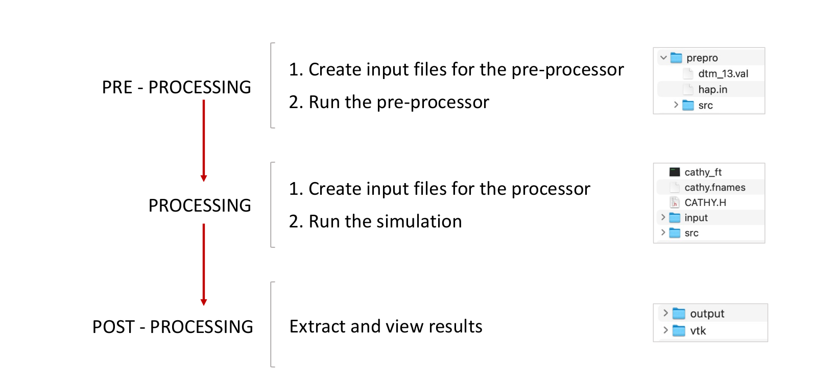

.. _gettingstarted:

Getting Started
===============
    
Three steps are required to implement a working CATHY model of a specific case study (see fig. below), namely **pre-processing**, **processing**, and **post-processing**, and the following steps are necessary to create the flow model:

1. Create the input files for the pre-processor hap
2. Run the pre-processor hap
3. Create the input files for the processor CATHY
4. Perform the simulation by running the processor CATHY
5. Run the post-processing functions to extract and view results
    
    

  
  
  
Create a project 
----------------

This will download automatically the source file from the gitbucket.

.. code:: bash

   from pyCATHY import cathy_tools
   from pyCATHY.plotters import cathy_plots as cplt
   simu = cathy_tools.CATHY(dirName=path2prj)

Update pre-processing files 
---------------------------

.. code:: bash

   simu.update_prepo_inputs()

Run preprocessor
----------------

.. code:: bash

   simu.run_preprocessor(verbose=True)
   

Run processor
-------------

.. code:: bash

   simu.run_processor(verbose=True)

Show outputs
------------

.. code:: bash

   cplt.show_vtk(unit="pressure", timeStep=1, notebook=False,
              path="./my_cathy_prj/vtk/")
   
   
